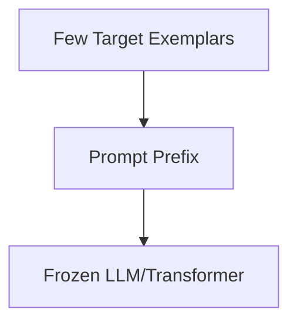

# C. Few-Shot Domain Adaptation / In-Context Adaptation

Detailed information on Few-Shot / In-Context DA.

```mermaid
graph TD
A[Few Target Exemplars] --> B[Prompt Prefix]
B --> C[Frozen LLM/Transformer]
```
