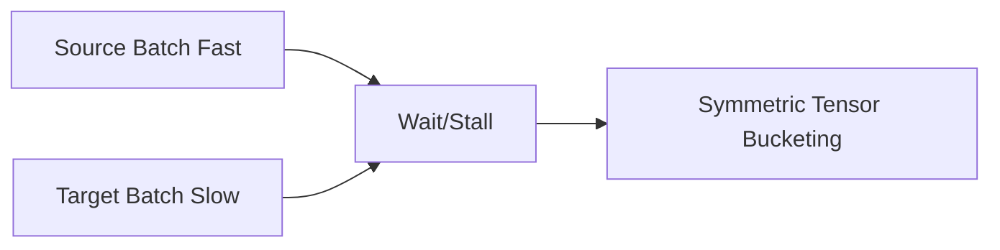

# The Distributed Cross-Domain Batch Load-Imbalance Stall

Detailed information on Batch Load-Imbalance.

```mermaid
graph LR
A[Source Batch Fast] --> C[Wait/Stall]
B[Target Batch Slow] --> C
C --> D[Symmetric Tensor Bucketing]
```
