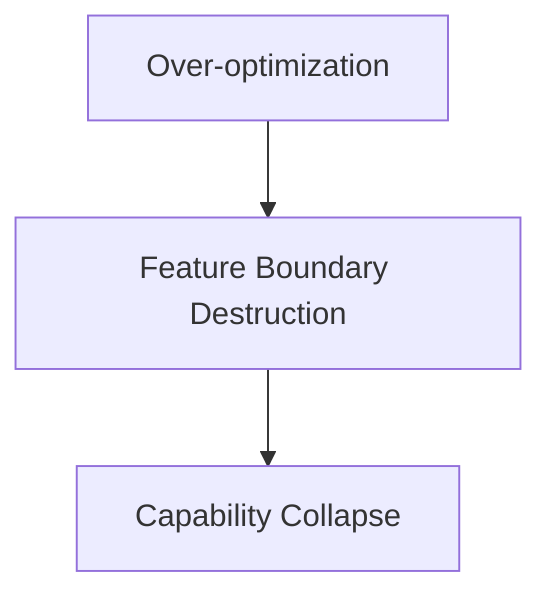

# The Negative Transfer and Capability Collapse Wall

Detailed information on Negative Transfer.

```mermaid
graph TD
A[Over-optimization] --> B[Feature Boundary Destruction]
B --> C[Capability Collapse]
```
