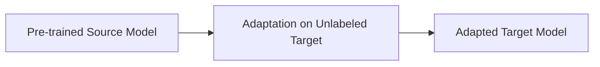

# D. Source-Free Domain Adaptation (SFDA)

Detailed information on Source-Free Domain Adaptation.

```mermaid
graph LR
A[Pre-trained Source Model] --> B[Adaptation on Unlabeled Target]
B --> C[Adapted Target Model]
```
