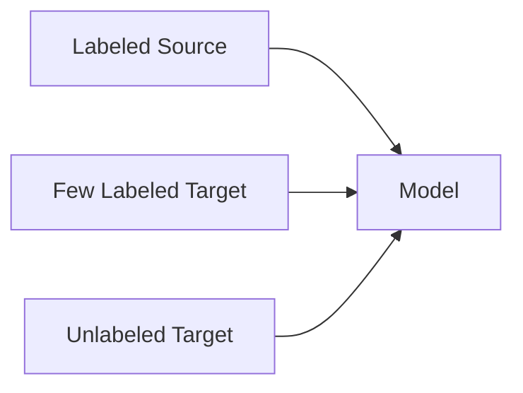

# B. Semi-Supervised Domain Adaptation (SSDA)

Detailed information on Semi-Supervised Domain Adaptation.

```mermaid
graph LR
A[Labeled Source] --> C[Model]
B[Few Labeled Target] --> C
D[Unlabeled Target] --> C
```
