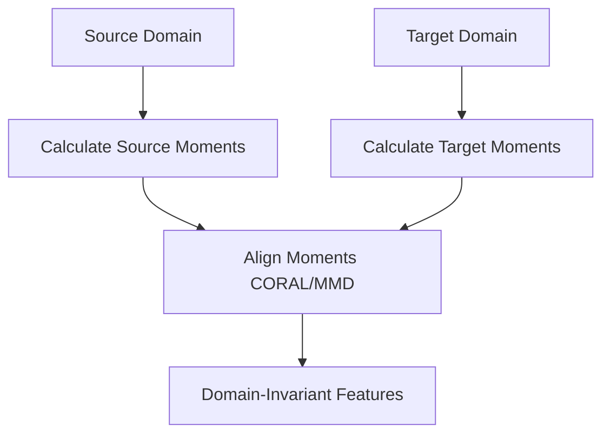

# The Statistical Moment Matching Era (Traditional Machine Learning Baseline)

Detailed information on Statistical Moment Matching.

```mermaid
graph TD
A[Source Domain] --> B[Calculate Source Moments]
C[Target Domain] --> D[Calculate Target Moments]
B --> E[Align Moments CORAL/MMD]
D --> E
E --> F[Domain-Invariant Features]
```
