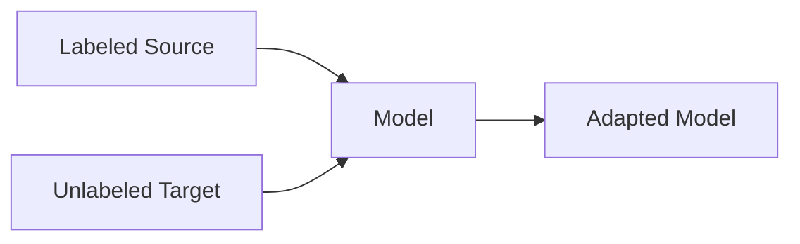

# A. Unsupervised Domain Adaptation (UDA)

Detailed information on Unsupervised Domain Adaptation.

```mermaid
graph LR
A[Labeled Source] --> C[Model]
B[Unlabeled Target] --> C
C --> D[Adapted Model]
```
